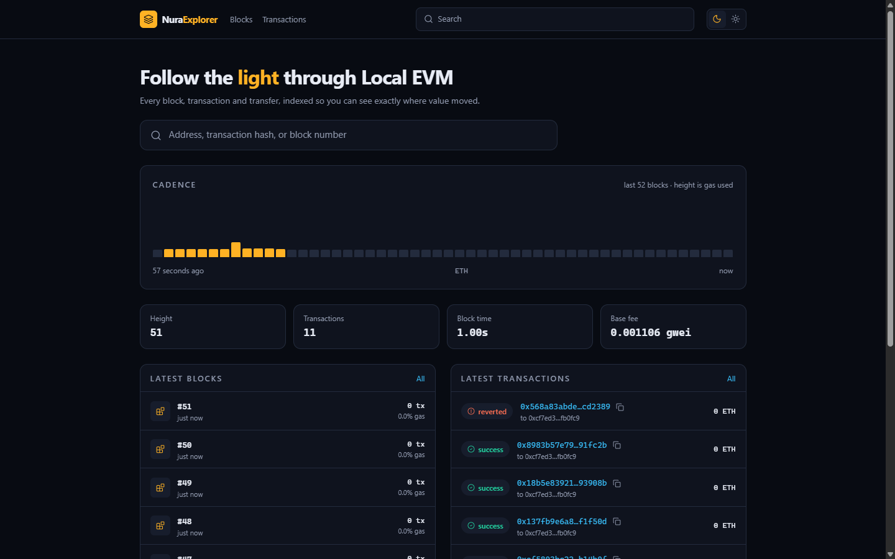
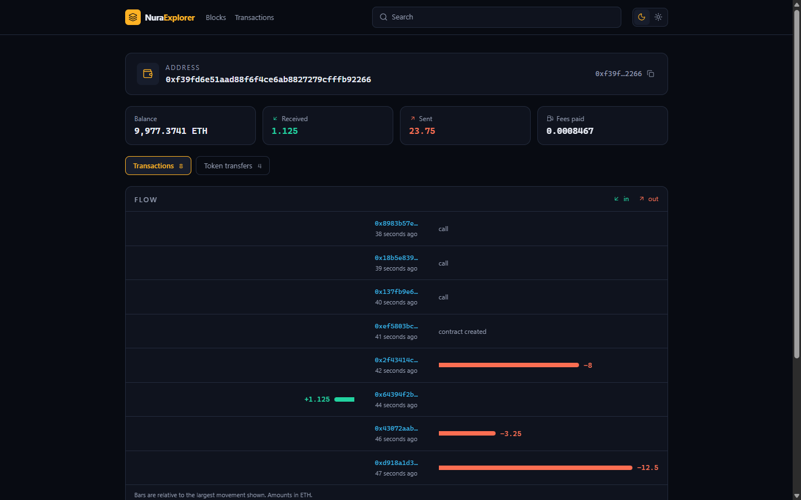
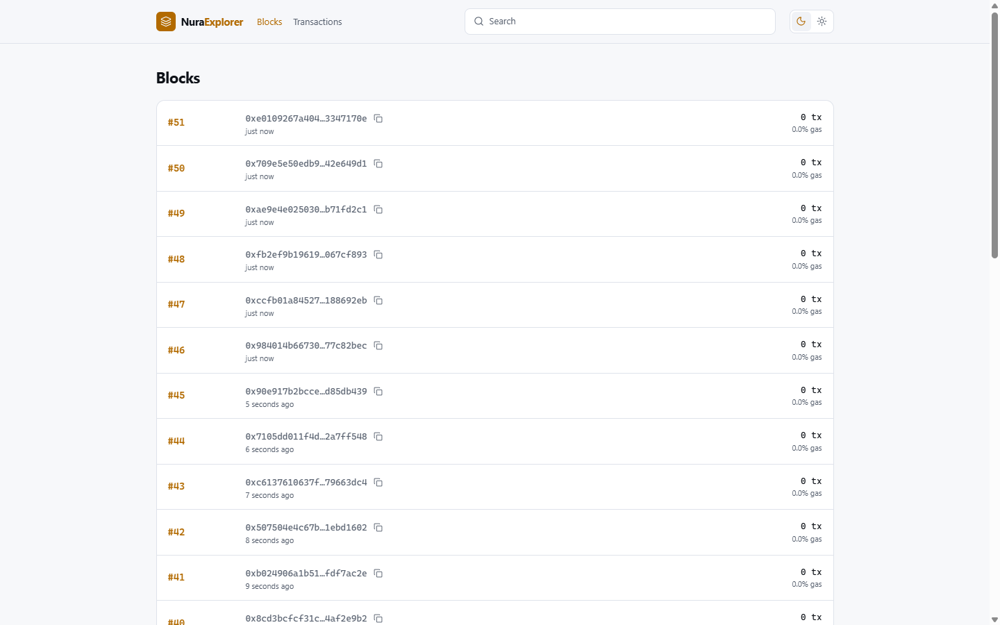
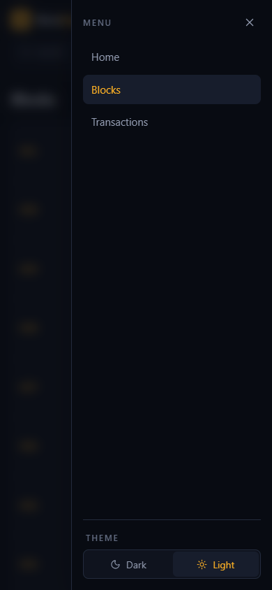

<div align="center">

# Nura Explorer

**An open source block explorer for EVM chains. Every block, transaction and transfer is indexed locally, so you can follow where value actually moved.**

[](https://github.com/NuraChain/Explorer/actions/workflows/ci.yml)
[](https://github.com/AzerothJS/AzerothJS)
[](https://nodejs.org)



</div>

---

## What it is

A self-hosted explorer for any EVM-compatible chain. Point it at a JSON-RPC endpoint and it
indexes the chain into a local SQLite file, then serves six pages over that index: a live
overview, blocks, transactions, block and transaction detail, and an address page with a flow
ledger showing value in and out.

It speaks **standard Ethereum JSON-RPC** and nothing else - no vendor API, no hosted service, no
tracing extensions. It runs against NuraChain, a local Hardhat or Anvil node, or any other EVM
network.

It is **not** a Bitcoin explorer: Bitcoin is UTXO-based and speaks a different RPC.

### Why it indexes instead of proxying the node

Ethereum JSON-RPC has no method that answers *"what has this address done?"*. There is
`eth_getBalance` for a number and `eth_getTransactionByHash` for a hash you already know, but no
address history. Every explorer you have used - Etherscan included - answers that question from
its own index rather than from the node. So does this one.

The index is a **cache, not a source of truth**. Delete `.data/index.db` and it replays from
`START_BLOCK`.

---

<div align="center">

| | |
| --- | --- |
|  |  |



</div>

## Requirements

- **Node.js >= 24** - the server runs TypeScript natively, with no build step
- An EVM JSON-RPC endpoint

---

## Run it

```sh
npm install
cp server/.env.example server/.env    # then set RPC_URL and CHAIN_ID
npm run dev
```

Open **http://localhost:3001**. The API runs on **:3000**, with `/api` proxied to it.

The indexer starts with the server, catches up from `START_BLOCK` to the head, then follows new
blocks every `POLL_MS`. The first sync of a long chain takes a while; the UI works while it runs
and fills in as blocks land.

### Against NuraChain

```ini
RPC_URL=https://rpc.nurachain.net
CHAIN_ID=1010
CHAIN_NAME=Nura Chain
CURRENCY_SYMBOL=NURA
CHAIN_SITE_URL=https://nurachain.net
START_BLOCK=0
```

### Against a long-lived public chain

Indexing a mainnet from genesis is not practical on one machine. Start near the head:

```ini
RPC_URL=https://your-node
CHAIN_ID=1
START_BLOCK=21000000     # a recent height, NOT 0
POLL_MS=6000             # keep it under the chain's block time
BATCH_SIZE=25            # raise for a fast node, lower for a rate-limited one
```

Only blocks from `START_BLOCK` up are searchable. That is the trade for a first sync measured in
minutes rather than weeks.

---

## Configuration

Every key the server reads is documented in [`server/.env.example`](server/.env.example). Keep
the two files in step: a key added there belongs in `.env` too.

| Key | Default | What it does |
| --- | --- | --- |
| `PORT` | `3000` | Server port |
| `NODE_ENV` | `development` | `production` serves the built client |
| `CLIENT_DIR` | `../application/dist` | Built client, served from the same origin |
| `SSR_ENTRY` | `../application/dist-server/entry.server.js` | SSR bundle |
| `RPC_URL` | `http://127.0.0.1:8545` | The chain to index |
| `CHAIN_ID` | `31337` | Chain id, shown in the UI |
| `CHAIN_NAME` | `Local EVM` | Shown in the header and footer |
| `CURRENCY_SYMBOL` | `ETH` | Suffixes every amount |
| `CURRENCY_DECIMALS` | `18` | Native token decimals |
| `CHAIN_SITE_URL` | *(unset)* | The chain's website, linked from its name in the footer |
| `START_BLOCK` | `0` | Height to index from |
| `POLL_MS` | `2000` | How often to check for a new head |
| `BATCH_SIZE` | `25` | Blocks per catch-up batch |
| `DB_PATH` | `.data/index.db` | The SQLite index |

---

## Production

```sh
npm run build
NODE_ENV=production npm start
```

One process serves the API and the built client on one origin, so there is no CORS to configure.
Put a reverse proxy in front for TLS.

In a container - build from the repo ROOT, where the workspace lockfile and `.dockerignore` live:

```sh
docker build -f server/Dockerfile -t nura-explorer .
docker run -p 3000:3000 --env-file server/.env nura-explorer
```

`/api/healthz` answers orchestrator probes.

### As a systemd service

On a bare host, from a fresh clone - the unit runs the server directly from source, with the
client built ahead of it:

```sh
npm ci
cp server/.env.example server/.env    # then set RPC_URL and CHAIN_ID
npm run build
sudo npm run service:install
sudo npm run service:start
```

`sudo npm run service:deploy` rebuilds and restarts after a `git pull`.

What to know before running it for real:

- **The index is a file.** Back up `DB_PATH`, or accept a replay on loss. Deleting it is safe.
- **Reorgs are handled.** On a parent-hash mismatch the indexer walks back and rolls the orphaned blocks out, rather than serving transactions that were un-mined.
- **`eth_getBlockReceipts` is probed once** and falls back to per-transaction receipts on nodes
  that lack it - slower, still correct.
- **Rate limiting is on.** A burst of requests answers `429`.

---

## Scripts

| Command | What it does |
| --- | --- |
| `npm run dev` | Server and client together |
| `npm run build` | Client bundle, SSR bundle, prerender |
| `npm start` | Run the built app (set `NODE_ENV=production`) |
| `npm run check` | Typecheck and lint every workspace |
| `npm test` | Server and unit suites |
| `npm run service:deploy` | Rebuild and restart (root) |
| `npm run service:install` | Write and load the systemd unit (root) |
| `npm run service:uninstall` | Stop, disable and remove the unit (root) |
| `npm run service:start` / `:stop` / `:restart` | Control the service (root) |
| `npm run service:status` | What systemd thinks of it |

---

## Structure

```
application/                    the UI
  src/components/ui/            button, badge, card, input, pagination, skeleton, toast, tooltip
  src/components/chain/         hash links, cadence strip, flow ledger
  src/pages/                    home, blocks, block, txs, tx, address
server/                         the API and the indexer
  src/app.ts                    every route, schema and handler, declared once
  src/chain/client.ts           the JSON-RPC gateway
  src/chain/indexer.ts          catch-up, follow, reorg rollback, transfer decoding
  src/chain/store.ts            the SQLite index
```

The API is declared once in `server/src/app.ts`, and the browser gets a typed client from that
same declaration - `client.blocks.one(...)` is checked against the handler's own schema.

---

## Contributing

Issues and pull requests are welcome. For anything larger than a fix, open an issue first so the
approach can be agreed before you spend the time.

Before opening a pull request, both gates must pass:

```sh
npm run check
npm test
```

House style is enforced by the linter and visible in any neighbouring file: Allman braces, one
import per module, and comments that state a constraint the code cannot show rather than narrating
what changed.

- **Adding a page:** one row in `application/src/routes.ts` plus its `*.page.azeroth` component.
- **Adding a chain field:** it starts in `server/src/schemas.ts`. The browser's client is inferred
  from the server's declaration, so the wire shape is decided in exactly one place.
- **Anything touching amounts** belongs in `application/src/lib/format.ts` and needs a test. A
  uint256 does not survive a double, and an explorer that misreports a balance has failed at its
  only job.

## Security

**Do not open a public issue for a security bug.** Report it privately so a fix can ship before
the details are public.

Two things worth knowing before you deploy this:

- **The index is a cache, never a source of truth.** Every figure the UI shows can be re-derived
  from the chain by deleting `DB_PATH` and replaying. Nothing irreplaceable lives in it.
- **`RPC_URL` may carry a provider key.** It is read server-side and never reaches the browser -
  the client only ever talks to this server's own API. Keep it that way when adding endpoints.

## License

MIT
